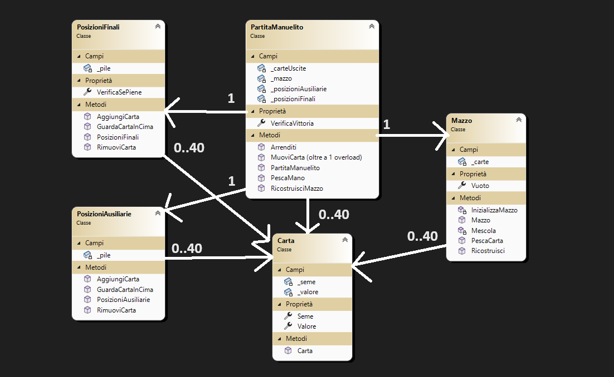

# **Solitario Manuelito** 🎮🃏
##  **Come si gioca?** 🎲🤔
Lo scopo di questo solitario è di **costruire e completare le basi poste al di sopra del tallone**, scorrendolo di tre carte in tre carte, di cui solo la prima è utilizzabile. Se questa viene spostata, la sottostante verrà liberata e diventerà anch’essa utilizzabile. 
Al di sotto del tallone, invece, sono presenti quattro sequenze da utilizzare come ausilio per la riuscita del solitario. 
Per le basi vale la regola dello stesso seme in senso ascendente, mentre nelle sequenze vale quella del seme diverso in senso discendente. 
Le carte in cima alle sequenze, così come le carte del pozzo, possono essere posizionate sulle basi e/o sulle sequenze, mentre il numero di distribuzioni è pari a 3. 
*Può essere spostata solo una carta alla volta.*
## **Mock-up** 🖇️🎨
Questa è una illustrazione grafica di come il programma sarà e come interagisce a seconda dell'azione (In questo caso, vengono illustrati solo le variazioni di pagina e seconda dell'azione)

## **Diagramma delle Classi** 📊📈

## Come si installa? 🧰🛠️
### 1. GitHub Clone 🤖🗃️
***!Questo metodo richiede Git installato nel proprio computer!***

Aprite la console e posizionatevi nella cartella in cui desiderate installare il programma ed eseguite il seguente comando: `git clone https://github.com/LianTorrico/Solitario-Manuelito`
### 2. Installare lo zip 📦
Nella pagina di questo repository, premere su "<>Code" e premere su Download Zip.

## Requisiti del sistema 📑
### Requisiti Minimi
<code>OS: Windows 10 / 11 - 64 bit 
Processore: Qualsiasi processore 1 GHz +
 Memoria: 3GB
 Scheda video: Qualsiasi
 DirectX: Versione 11+
 Spazio: 100 MB di spazio disponibile</code>
### Requisiti Consigliati
<code>OS: Windows 10 / 11 - 64 bit
 Processore: Qualsiasi processore 1 GHz+
 Memoria: 4GB
 Scheda video: Qualsiasi
 DirectX: Versione 11+
 Spazio: 120 MB di spazio disponibile</code>

**Attenzione! I requisiti potrebbero variare con il passare del tempo.**

## **Sviluppatori** 💻🎧📱
1. [Lorenzo Morini](https://github.com/MoroQuack)
2. [Francesco Foschi](https://github.com/supersayan1)
3. [Lian Torrico](https://github.com/LianTorrico)
