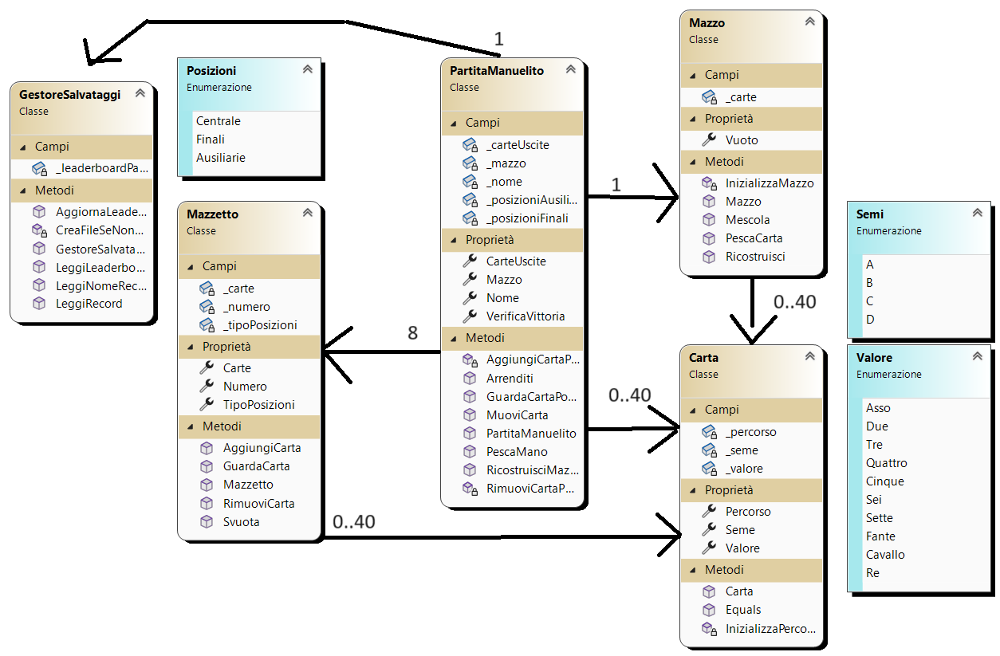

# **Solitario Manuelito** 🎮🃏
##  **Come si gioca?** 🎲🤔
Lo scopo di questo solitario è di **costruire e completare le basi poste al di sopra del tallone**, scorrendolo di tre carte in tre carte, di cui solo la prima è utilizzabile. Se questa viene spostata, la sottostante verrà liberata e diventerà anch’essa utilizzabile. 
Nel menu scrivere il nome e cliccare gioca.
Al di sotto del tallone, invece, sono presenti quattro sequenze da utilizzare come ausilio per la riuscita del solitario. 
Per le basi vale la regola dello stesso seme in senso ascendente, mentre nelle sequenze vale quella del seme diverso in senso discendente. 
Le carte in cima alle sequenze, così come le carte del pozzo, possono essere posizionate sulle basi e/o sulle sequenze, mentre il numero di distribuzioni è pari a 3. 
*Può essere spostata solo una carta alla volta.*
Per spostare una carta prima cliccare sulla carta che si desidera spostare in modo da selezionarla, se è stata selzionata correttamente il bordo rimarrà azzurro anche dopo aver spostato il cursore.
Ora cliccare nella posizione nella quale si vuole spostare la carta e se possibile la carta verrà spostata.
In caso di mosse illegali o altri errori come provare a selezionare un mazzetto vuoto verrà mostrato l'errore e la selezione tolta lasciando poi continuare la partita normalmente.
Per pescare cliccare il mazzo, se il mazzo finisce cliccare il suo spazio vuoto lo ricreerà con le carte uscite.
Se si vince il proprio punteggio col proprio nome verrà aggiunto alla classifica locale, visualizzabile dal menu cliccando il pulsante classifica.
## **Mock-up** 🖇️🎨
Questa è una illustrazione grafica di come il programma sarà e come interagisce a seconda dell'azione (In questo caso, vengono illustrati solo le variazioni di pagina e seconda dell'azione)

## **Diagramma delle Classi** 📊📈

## Come si installa? 🧰🛠️
### 1. GitHub Clone 🤖🗃️
***!Questo metodo richiede Git installato nel proprio computer!***

Aprite la console e posizionatevi nella cartella in cui desiderate installare il programma ed eseguite il seguente comando: `git clone https://github.com/LianTorrico/Solitario-Manuelito`
### 2. Installare lo zip 📦
Nella pagina di questo repository, premere su "<>Code" e premere su Download Zip.

## Requisiti del sistema 📑

 | Requisiti minimi |             |
|-------------------|-------------|
| OS | Windows 10 / 11 - 64bit |
| Processore | 1 GHz |
| RAM | 3GB |
| Scheda video | Qualsiasi |
| DirectX | Versione 11+ |
| Spazio |	400 MB |

 | Requisiti Consigliati |             |
|-------------------|-------------|
| OS | Windows 10 / 11 - 64bit |
| Processore | 1 GHz |
| RAM | 4GB |
| Scheda video | Qualsiasi |
| DirectX | Versione 11+ |
| Spazio |	500 MB |

**Attenzione! I requisiti potrebbero variare con il passare del tempo.**

## **Sviluppatori** 💻🎧📱
1. [Lorenzo Morini](https://github.com/MoroQuack)
2. [Francesco Foschi](https://github.com/supersayan1)
3. [Lian Torrico](https://github.com/LianTorrico)

<!-- ALL-CONTRIBUTORS-LIST:START - Do not remove or modify this section -->
<!-- prettier-ignore-start -->
<!-- markdownlint-disable -->
<table>
  <tbody>
    <tr>
      <td align="center" valign="top" width="14.28%"><a href="https://github.com/LorenzoMorini777"> <b>LorenzoMorini777</b></a> <a href="#code-LorenzoMorini777" title="Code">💻</a> <a href="#test-LorenzoMorini777" title="Tests">⚠️</a> <a href="#bug-LorenzoMorini777" title="Bug reports">🐛</a> <a href="#ideas-LorenzoMorini777" title="Ideas, Planning, & Feedback">🤔</a> <a href="#maintenance-LorenzoMorini777" title="Maintenance">🚧</a> <a href="#mentoring-LorenzoMorini777" title="Mentoring">🧑‍🏫</a> <a href="#infra-LorenzoMorini777" title="Infrastructure (Hosting, Build-Tools, etc)">🚇</a></td>
    </tr>
  </tbody>
</table>
<!-- markdownlint-restore -->
<!-- prettier-ignore-end -->

<!-- ALL-CONTRIBUTORS-LIST:END -->
